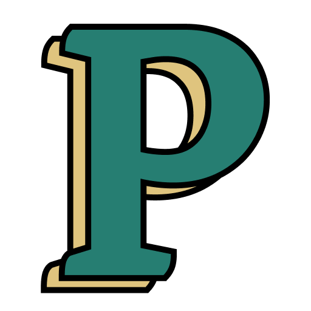

<h1 align="center"></h1>

Hey, thanks for poking around my repo! I wrote about myself and my digital garden on [petemillspaugh.com/about](https://petemillspaugh.com/about), so I'll use this space to touch on some technical things about my garden.

## React, Next

React and Next are the web framework and meta framework I know best. I really enjoy working with both.

### Components

Components are a spectrum from primitives like `Blockquote` to highly composed components like `Garden`. It's hard to draw a line in the sand between component-library-components that might live in `/components/lib` and bespoke components that are reused just once or not at all. So I mixed them all in one `/components` folder. I settled on this structure based on Josh Comeau's opinion on the subject in his React course.

I rely on unstyled component libraries like [Radix UI](https://radix-ui.com) for my underlying component primitives when it comes to complex implementations like `Tooltip` and `Switch`. I love getting accessibilty and usability out of the box with these sorts of libraries.

## Styled Components

I like the flexibility of CSS-in-JS and the colocation of markup + styles with `styled-components`. I also prefer writing vanilla CSS to writing utility classes, e.g. with Tailwind.

## MDX

I'm using [MDX](https://mdxjs.com/) with `next-mdx-remote` for my content.

## Domain registrar

Cloudflare is my domain registrar of choice. They don't mark up domains and come with the expected features (SSL etc).

## Deployment

I'm deploying on Vercel. Automatic preview deployments on PRs are really handy for a static site like this.
